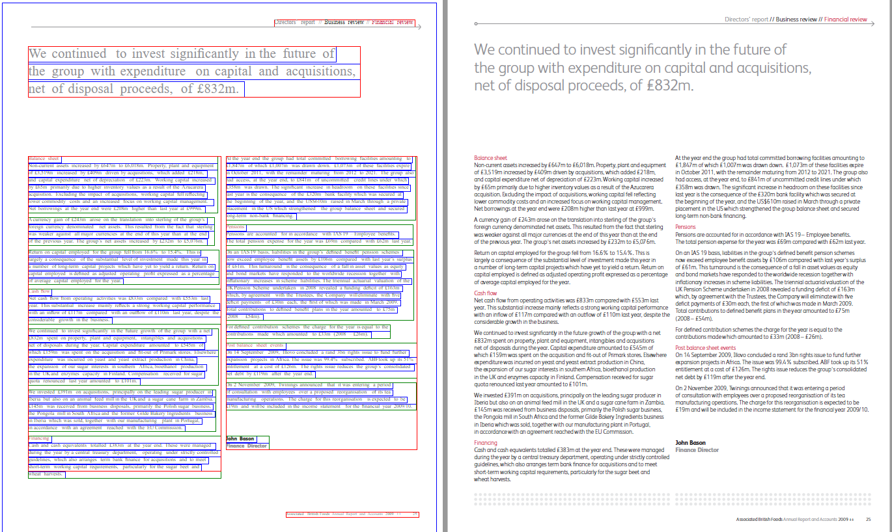
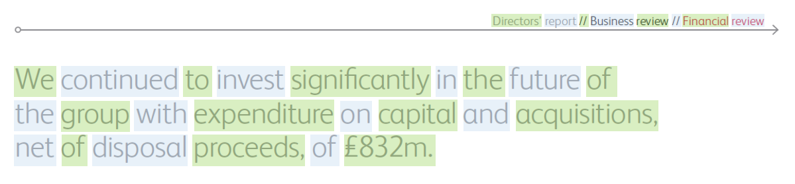
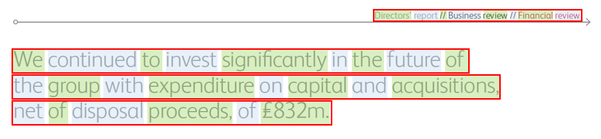
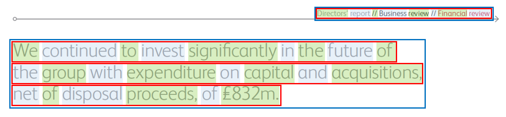
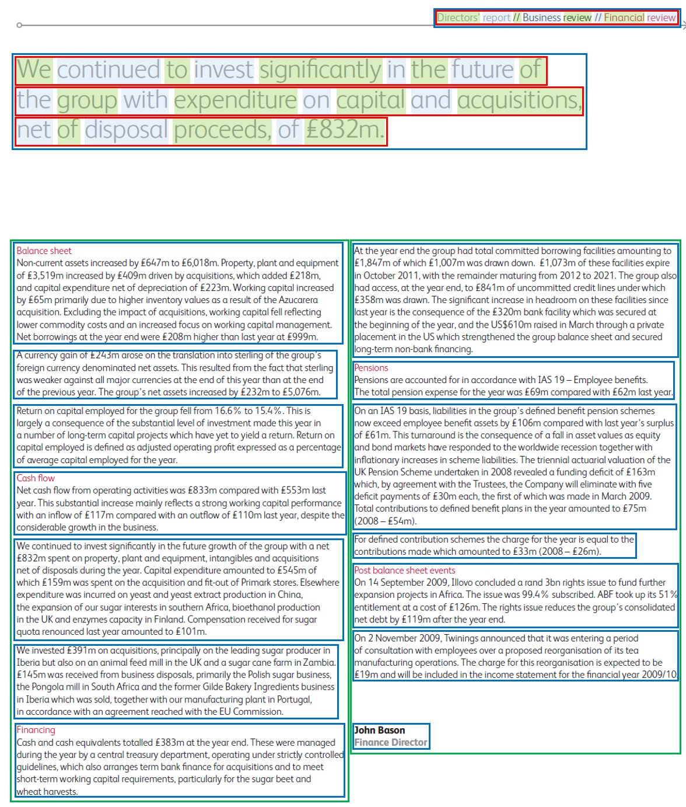

# PDFExtract
## Table of Contents
- [Introduction](#introduction)
  - [What is PDFExtract](#what-is-pdfextract)
- [Installation](#installation)
- [Using PDFExtract.jar](#using-pdfextractjar)
  - [Command-line PDF Extraction](#command-line-pdf-extraction)
  - [Library PDF Extraction](#library-pdf-extraction)
- [How It Works](#how-it-works)
  - [Basic Process](#basic-process)
  - [Words](#words)
  - [Lines](#lines)
  - [Paragraphs](#paragraphs)
  - [Columns](#columns)
  - [Pages](#pages)
- [Document Format](#document-format)
  - [Alignment Optimized HTML](#alignment-optimized-html)
  - [ID Formats](#id-formats)
  - [Classes](#classes)
  - [Coordinates](#coordinates)
  - [Font Normalization](#font-normalization)
  - [Joining Lines](#joining-lines)
  - [Repairing Object Sequences](#repairing-object-sequences)
- [FAQ](#FAQ)

----
## Introduction
### What is PDFExtract?
PDFExtract is a PDF parser that converts and extracts PDF content into a HTML format that is optimized for easy alignment across multiple language sources. The output is intended for this purpose only and not for rendering as HTML in a web broweser. While there are many PDF extraction and HTML DOM conversion tools, none are designed to prepare data for alignment between multilingual websites. Typically, other tools will extract to a HTML format that is designed to be rendered for human consumption, are very heavy and bloated with informaiton that is not needed, while missing information that would be helpful to an aligner. The extracted format from PDFExtract is simplified and normalized so that it can be easily matched to other documents that contain the same or similar content translated in different languages. Tools such as Bitextor are able to directly process the outputs.

----
## Installation
Installation instructions are provided in [INSTALL.md](INSTALL.md)

----
## Using PDFExtract.jar

### Command-line PDF Extraction 
The command-line PDFExtract is contained in the PDFExtract.jar package that may be downloaded and directly executed on all the java-enabled platforms.

For extracting a PDF file to the alignment optimized HTML file type:

```sh
java -jar PDFExtract.jar -I <input_file> -O <output_file> -B <batch_file> -L [<log_path>] -R [<rule_path>] -T [<number_threads>] -LANG [<language>] -D -o [<options>]
```
*Arguments*
- `-I <input_file>` specifies the path to the source PDF file process for extraction. 
- `-O <output_file>` specifies the path to the output HTML file after extraction. 
- `-B <batch_file>` specifies the path to the batch file for processing list of files. The input file and output file are specified on the same line delimited by a tab. Each line is delimited by a new line character.
- `-L <log_path>` specifies the path to write the log file to. As it is common for PDF files to have issues when processing such as being password protected or other forms of restricted permissions, the log file can be written to a specifed location for additional processing. If not specified, then the log file will write to stdout.
- `-R <rule_path>` specifies a custom set of rules to process joins between lines. As this can vary considerably between languages, a custom set of rules can be implimented. See [Joining Lines](#joining-lines) for more details. If no path is specified, then PDFExtract.js will be loaded from the same folder as the PDFExtract.jar execution. If the PDFExtract.js file cannot be found, then processing will continue without analyzing the joins between lines.
- `-T <number_threads>` specifies the number of threads to run concurrently when processing PDF files. One file can be processed per thread. If not specified, then the default valur of 1 thread is used.
- `-LANG <lang>` specifies the language of the file using ISO-639-1 codes when processing. If not specified then the default language rules will be used. 
    If `DETECT` is specified instead of a language code, then each paragraph will be processed via Language ID tools to determine the language of the paragraph. The detected language will be used for sentence join analysis. (DETECT is not supported in this version)  
- `-D` enables Debug/Display mode. This changes the output to a more visual format that renders as HTML in a browser.
- `-o <options>` specifies control parameters. (Reserved for future use where more conifgurable parameters will be permitted.)

**Example:**

This example processes a single English PDF file in English.

```sh
java -jar PDFExtract.jar -I /test/pdf/myfile.pdf -O /test/htm/myfile.htm -LANG en
```

This example processes a batch of files as specified in `batch2.txt` using 3 threads and writing to a user specified log file. Custom JavaScript rules for sentence joining and object sequence repairs is also specified.

```sh
java -jar PDFExtract.jar -B /test/batchlists/batch2.txt -L /tests/logs/batch2.log -R /test/customrules/ruleset1.js -T 3 
```

The contents of `batch2.txt` are:
```text
/test/pdf/myfile1.pdf	/test/htm/myfile1.htm
/test/pdf/myfile2.pdf	/test/htm/myfile2.htm
/test/pdf/myfile3.pdf	/test/htm/myfile3.htm
/test/pdf/myfile4.pdf	/test/htm/myfile4.htm
/test/pdf/myfile5.pdf	/test/htm/myfile5.htm
/test/pdf/myfile6.pdf	/test/htm/myfile6.htm
```

### Library PDF Extraction

PDFExtract may be usef from within Java with the following import.

TODO: UPDATE DOCS TO SHOW ALL OPTIONS THE SAME AS COMMAND LINE

```java
import com.java.app.PDFExtract;

PDFExtract pdf = new PDFExtract(logpath);
// Single File
pdf.Extract(inputFile, outputFile, "options");

// Batch File
pdf.Extract(batchFile, "options");
```

----
## How It Works
PDF is a publishing format and is not designed for easy editing and manipulation. At the core of PDF is an advanced imaging model derived from the PostScript page description language. This PDF Imaging Model enables the description of text and graphics in a device-independent and resolution-independent manner. To improve performance for interactive viewing, PDF defines a more structured format than that used by most PostScript language programs. Unlike Postscript, which is a programming language, PDF is based on a structured binary file format that is optimized for high performance in interactive viewing. PDF also includes objects, such as annotations and hypertext links, that are not part of the page content itself but are useful for interactive viewing and document interchange.

Our first step is to extract the PDF content out into a DOM that can be used to further processed. PDFExtract uses the Pdf2Dom Java library as a parser for the CSSBox rendering engine in order to get a DOM designed for rendering in HTML, but not suitable for mining. PDFExtract further processes and mines the DOM into a normalized and simplified HTML format. 

The core concept is very simple. Regions within the PDF are defined as a set of boxes. The lowest level of a box is a letter, then progressively expands to words, lines, paragraphs, columns and pages. Words are merged into lines. Lines are merged into paragraphs. The below examples show the original PDF file in the right, with the page marked in a blue box, columns marked in a red box, paragraphs marked in a green box and lines marked in a blue box. Once the clean boxed regions are defined, the content is merged to create clean HTML. 

All content in the HTML output is sorted by the position it appears on the page using the top left coordinates. This sorting is necessary as the order that the information appeared in the PDF file may not be in sequence. 

>Note: This will likely not work on languages that are rendered right-to-left and has not been tested at present for such languages.



### Basic Process
#### Sort Objects
Objects in a PDF are not necessarily in sequence. As rendering is using X and Y coordinates, they can be in any order and still look correct visually. For example, a page footer could be in the middle of the objects in sequence, not the last set of objects as they would appear visually. The first task is to sort the objects by X and Y coordinates at a page by page level. 
Words
Words are first identified and repaired. PDF will usually have an entire word in one object, but sometimes the PDF creation tool will create words using multiple objects. In some cases, as granular as 1 object per letter. Visually in a PDF this looks fine, however, in order to export the text into a useable format for processing, the objects must be combined into words.  
### Words



### Lines
Once words have been repaired, the next stage is to identify the lines by grouping words in sequence together.
 


### Paragraphs
Once lines have been identified, they can be analyzed as groups of lines by measuring the spacing between lines. When the line spacing varies, it is typically a new paragraph. 
Lines may have different left and right offsets such as for indentation and wrapping. The top and left most position can be recorded as X and Y values of the lines for the paragraph. The width of the paragraph is calculated by looking at the right most position of all lines. The width can be calculated looking at the Y position + the height of the lower most line. 
 

 
### Columns
Columns are calculated by analyzing the vertical path of paragraphs to determine in they are in a column. Generally, paragraphs will have similar widths and if there is a second column, then it will be detectable by looking at the X positions of paragraphs for similarity. 



### Pages
Pages are already defined by the orignal HTML DOM after the initial extraction from PDF. 

## Output HTML Format ##
Once the various page regions are defined as described above, the objects that fall within the each region can be extracted into a normalized HTML format. The HTML format is designed specifically to make alignment across 2 or more webpages simple and easy. 

### Alignment Optimized HTML
```html
<html>
	<!--Generated Normalized Fonts-->
	<!--Standard text font for the document has no class assigned to the paragraph-->
	<!--Classes page, header, footer, column do not need a style. They are for classification only,
	    but a style can be applied for visual rendering -->
	<style>
		.h1 {
			font-family:arial;
			font-weight:bold;
			font-size:20pt;
			text-decoration:normal;
			font-style:italic;
		}
		.h2 {
			font-family:arial;
			font-weight:bold;
			font-size:18pt;
			text-decoration:underline;
			font-style:normal;
		}
	</style>
	<!--
	<style>
		body {
			font-family:arial;
			font-weight:normal;
			font-size:10pt;			
			text-decoration:normal;
			font-style:normal;
		}
		p{
			position: relative;
			border:1px solid red;
		}
		.page{ 
			border:1px dashed silver;
		}
		.header{
			position: relative;
			border:1px solid cyan;
		}
		.footer{
			position: relative;
			border:1px solid purple;
		}
		.column{
			position: relative;
			border:1px solid orange;
		}
	</style>
	-->
	<body>
		<div id="page1" class="page">
			<div id="page1h1" class="header" style="top:0px;left:0px;width:100px;height:100px;" >
				<p id="page1h1p1" style="top:0px;left:0px;width:100px;height:100px;">
					<span id="page1h1pl1" class="line" style="top:0px;left:0px;width:100px;height:100px;">header text</span>
				</p>
			</div>
			<div id="page1c1" class="column" style="top:0px;left:0px;width:100px;height:100px;">
				<p id="page1c1p1" class="h1" style="top:0px;left:0px;width:100px;height:100px;">
					<span id="page1c1p1l1" class="line h1" style="top:0px;left:0px;width:100px;height:100px;">heading text 1</span>
				</p>
				<p id="page1c1p2" style="top:0px;left:0px;width:100px;height:100px;">
					<span id="page1c1p2l1" style="top:0px;left:0px;width:100px;height:100px;">paragraph 2 line 1</span>
					<span id="page1c1p2l2" joinscore=100.00" style="top:0px;left:0px;width:100px;height:100px;">paragraph 2 line 2</span>
				</p> 
			</div>
			<div id="page1f1" class="footer" style="top:0px;left:0px;width:100px;height:100px;">
				<p id="page1f1p1" style="top:0px;left:0px;width:100px;height:100px;">
					<span id="page1f1pl1" class="line" style="top:0px;left:0px;width:100px;height:100px;">footer text</span>
				</p>
			</div>
		</div>
		<div id="page2" class="page">
			...
		</div>
	</body>
</html>
```

### ID Formats
The ID of a element is defined by is parent structure with an incremental counter:

- page = page
- header = h
- footer = f
- column = c
- paragraph = p
- line = l

**Example**

Page 1, column 1, paragraph 3, line 2 would be written as `page1c1p3l2`.

### Classes
There are a simple set of class formats for div elements:
```sh
- page - the wrapping boundary of a page. 
- header - the wrapping boundary of the page header.
- footer - the wrapping boundary of the page footer.
- column - the wrapping boundary of a column.
```
Within a header, column or footer, the *p* element is used to mark a paragraph.
Within a paragraph, the *span* with a class name of `"line"` element is used to mark a line. If a span is encountered without the line class, then the style is used to specify special formatting that may be useful, but it is still within a line.

The basic structure is as follows
```sh
<div class="page"> \ <div class="column|header|footer"> \ <p> \ <span> 
```
### Coordinates
Columns, headers, footers, paragraphs and spans all have `top`, `left`, `width` and `height` parameters as part of the style.

Example

```
top:168.80069pt;left:342.9921pt;height:65.26792899999998pt;width:279.59444899999994pt;
```
### Font Normalization
Fonts within the document are analyzed. The dominant font is removed and considered to be set globally by default. Other fonts are put in place as needed with generated style sheet entries. Fonts that are very similar will be combined. Fonts are only applied to a span element and only when not the default/dominant font.

## Joining Lines
Lines are handled differently to the rest of the elements. Lines are represented by a `<span class="line"...>
` tag and have an additional attribute that provides recommendations on whethere a line is continued on the next line. Normal HTML automatically joins content together on a single line (with wrapping as needed by screen size) unless explictly instructed no to by the use of a `<br>` element or other line breaking elements. PDF files render text in a specified position, but do not retain any line wrapping or joining information. In many cases, rules can be used to determine if a 2 lines should be joined or not. However, there are many ambigious situations where a rule is insufficent. In this version of PDFExtract, we are determining whether to join only with relatively simple rules. Future versions will impliment machine learning approaches to provide intelligence to joining that is able to handle ambigious exceptiions with more accuracy.

Sentence joining is designed to be flexible and for custom rules to be applied. PDFExtract impliments Oracle's Nashorn JavaScript engine for custom rules that handle sentence joining without the need to complie the rules into the code. 

- `analyzeJoins(<lines>, <lang>)` - Analyzes the liklihood of the lines in sequence joining to the following line and adding a `joinScore` attribute with a value between 0-100. Each line is delimited by \n and should include the full span tag.

## Repairing Object Sequences
Some PDF tools export malformed PDF content in some cases. For example, instead of rendering a word as a single object, a set of letters are rendered as individual objects. There are many exceptions that need to be handled. Common exceptions are handled wihtin the Java code. Additional custom exceptions can be handled in a JavaScript function.

- `repairObjectSequence(<line>)` - Analyzes the line of data and merges content where needed to single words. The input is all objects within the line and the output is the updated line that will be merged back into the page.


## Detecting Custom Headers and Footers
While the position of text on a page is helpful in determining headers and footers, it is often difficult to accurately detect a header and footer across languages. Custom logic can be added without recompiling using the `isHeader` and `isFooter` functions. 

TODO: Provide more details and sample rules.

```javascript
//Analyzes the lines in a chunk/paragraph to deterine if a line should be joined to the line that follows it.
function analyzeJoins(lines, lang) {
	
  //<span id="page1c1p1l1" joinScore="100.00" style="top:0px;left:0px;width:0px;height:0px;">
  switch(lang.toLower()) {
    case "en":
      // code block
      break;
    case "fr":
      // code block
      break;
    default:
      // code block
   }
   return lines;
}

//Adjusts the line to repair poorly rendered objects that may be split, but are one.
function repairObjectSequence(line) {

   return line;
}

//Custom detection that would identify a section as a header. This is only called if internal logic has not already identified the content as a header and is within the first 5 paragraphs on the page.
function isHeader(lines, pageWidth, pageHeight) {
   //code block
   return false;
}

//Custom detection that would identify a section as a footer. This is only called if internal logic has not already identified the content as a footer and is within the last 5 paragraphs on the page.
function isFooter(lines, pageWidth, pageHeight) {
  //code block
  return false;
}
```

> **Note:**
>
> These rules can become very complex depending on the language. Many rules are quite simple at a basic level, but depending on the layout of the page (i.e. indentations around a shape), the joins can be difficult. At present it is recommended to use the `top` and `left` attributes to handle indentation related rules and other similar complexities outside of PDFExtract. Future versions will look to use machine learning models to assist in more ambigious join decisions. Future versions will also support the use of LanguageID technology at a line level to support multiple languages in a single PDF document. This is out of scope for the time being.

## TODO
The below list is a set of features planned for future
- Right-to-left languages.
  - This code is untested on right-to-left languages and may need to be modified to support languages such as Arabic.
- Autodetect language. 
  - Out of scope for this version. Will be added into a future release, but will greatly slow down the processing so should be used only when needed.
  - When implimented, each line will be processed for language identification and tagged with the language information. This will improve sentence joining.
- Advanced sentence joining analysis. 
  - In order to join sentences, the language must be known. Some simplistic rules can be applied using the analyzeJoins JavaScript that deal with language specific joins or the join logic can be handled externally. Future versions will have the option to use models to assist in the decision to join lines or to keep them split.
- Handle tables
  - While columns are detected and handled, table detection is very complex and difficult. This is outside of the scope of the intial project version. As most alignable content is not in tables, this does not have a major impact on the outcome of bilingual corpus processing.

----
## FAQ
### Can the HTML output be loaded into the browser to view?
Yes. By default the HTML output is not in a format that will render well in a browser as it is formatted for optimal processing and hot intended to be viewed by humans. Use the `-D` option to output the HTML in a more visual format.

### Can this tool extract text from images embedded in PDF files?
No. This tool processes only text. It is not an OCR tool, it is only able to extract text from PDF if the data is already in text format.

### Why are the fonts normalized?
The fonts are normalized so that the file is significantly smaller and easier to align. When comparing a translated document in 2 or more languages, the structure should be very similar, with headings and other features comparable in both documents. Depending on the language, different fonts may be used. By normalizing the fonts, it is possible to use the normalized font class names as part of the alignment process.

