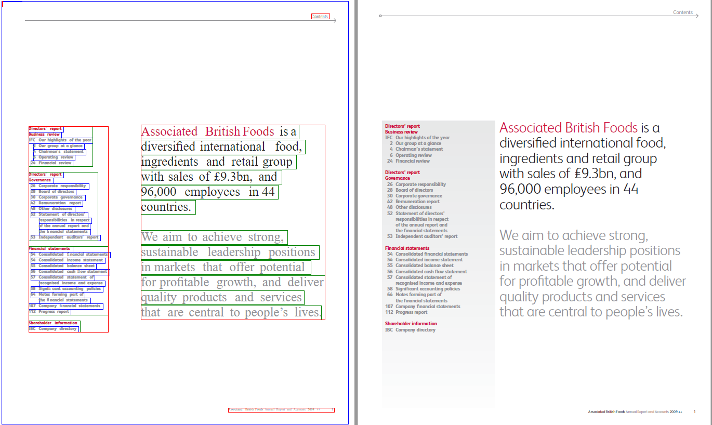

# PDFExtract
## Table of Contents
- [Introduction](#introduction)
  - [What is PDFExtract](#what-is-pdfextract)
- [Installation](#installation)
- [Using PDFExtract.jar](#using-pdfextractjar)
  - [Command-line PDF Extraction](#)
  - [Library PDF Extraction](#library-pdf-extraction)
- [How It Works](#how-it-works)
- [Alignment Optimized HTML Format](#alignment-optimized-html-format)
- [ID Formats](#id-formats)
- [Classes](#clases)
- [Coordinates](#coordinates)
- [Font Normalization](#font-normalization)
- [FAQ](#FAQ)


----
## Introduction
### What is PDFExtract?
PDF Extract is a PDF parser that converts and extracts PDF content into an optimized HTML format suitable for easy alignment across multiple language sources. While there are many PDF extraction and DOM conversion tools, typically other tools will extract to an HTML format or similar that is designed to be rendered for human consumption, is very heavy and bloated. The extracted format from PDF Extract is simplified and normalized so that it can be easily matched to other documents that contain the same or similar content translated in different languages. Tools such as Bitextor are able to directly process the outputs.

----
## Installation
Installation instructions are provided in [INSTALL.md](INSTALL.md)

----
## Using PDFExtract.jar

### Command-line PDF Extraction 
The command-line PDFExtract is contained in the PDFExtract.jar package that may be downloaded and directly executed on all the java-enabled platforms.

For extracting a PDF file to the alignment optimized HTML file type:

```1sh
java -jar PDFExtract.jar -I <input_file> -O <output_file> -B <batch_file> -L [<log_path>] -o [<options>]
```
*Arguments*
- `-I <input_file>` is the path to the source PDF file process for extraction. 
- `-O <output_file>` is the path to the output HTML file after extraction. 
- `-B <batch_file>` is the path to the batch file for processing list of files. The input file and output file are specified on the same line delimited by a tab. Each line is delimited by a new line character.
- `-L <log_path>` is the path to write the log file to. As it is common for PDF files to have issues when processing such as being password protected or other forms of restricted permissions, the log file can be written to a specifed location for additional processing. If not specified, then the log file will write to stdout.
- `-o <options>` specifies control parameters. (LIST TO COME, STILL BEING REFINED - languages etc.)

**Example:**

The example below will process *Domain Sample Data* file found in  `/data/mysample/` and write the *Domain Matched Data* to `/data/domain/automotive/en_de/`. Matching data will only be extracted if it scores above the threshold of 0.5.

```sh
FullProcess.py -dn automotive -s en -t de -dsd /data/mysample/ -dmd /data/domain/ -est 0.5
```

### Library PDF Extraction

PDFExtract may be usef from within Java with the following import.

```java
import com.java.app.PDFExtract;

PDFExtract pdf = new PDFExtract(logpath);
// Single File
pdf.Extract(inputFile, outputFile, "options");

// Batch File
pdf.Extract(batchFile, "options");
```

----
## How It Works
PDF is a publishing format and is not designed for easy editing and manipulation. At the core of PDF is an advanced imaging model derived from the PostScript page description language. This PDF Imaging Model enables the description of text and graphics in a device-independent and resolution-independent manner. To improve performance for interactive viewing, PDF defines a more structured format than that used by most PostScript language programs. Unlike Postscript, which is a programming language, PDF is based on a structured binary file format that is optimized for high performance in interactive viewing. PDF also includes objects, such as annotations and hypertext links, that are not part of the page content itself but are useful for interactive viewing and document interchange.

Our first step is to extract the PDF content out into a DOM that can be used to further processed. PDFExtract uses the Pdf2Dom Java library as a parser for the CSSBox rendering engine in order to get a DOM designed for rendering in HTML, but not suitable for mining. PDF Extract further processes and mines the DOM into a normalized and simplified HTML format.

The core concept is very simple. Regions within the PDF are defined as a set of boxes. The lowest level of a box is a letter, then progressively expands to words, lines, paragraphs, columns and pages. Words are merged into lines. Lines are merged into paragraphs. The below examples show the original PDF file in the right, with the page marked in a blue box, columns marked in a red box, paragraphs marked in a green box and lines marked in a blue box. Once the clean boxed regions are defined, the content is merged to create clean HTML. 


Gaps between lines are used to determine whether the next line is in the same paragraph or another. 

**NOTE:** Some issues remain in very large fonts and defining paragraphs. 



Once the regions boxes are defined, the objects that fall within the boxes can be extracted into a normalized HTML format. 

## Alignment Optimized HTML Format
```html
<html>
	<!--Generated Normalized Fonts-->
	<!--Standard text font for the document has no class assigned to the paragraph-->
	<!--Classes page, header, footer, column do not need a style. They are for classification only,
	    but a style can be applied for visual rendering -->
	<style>
		.h1 {
			font-family:arial;
			font-weight:bold;
			font-size:20pt;
			text-decoration:normal;
			font-style:italic;
		}
		.h2 {
			font-family:arial;
			font-weight:bold;
			font-size:18pt;
			text-decoration:underline;
			font-style:normal;
		}
	</style>
	<!--
	<style>
		body {
			font-family:arial;
			font-weight:normal;
			font-size:10pt;			
			text-decoration:normal;
			font-style:normal;
		}
		p{
			position: relative;
			border:1px solid red;
		}
		.page{ 
			border:1px dashed silver;
		}
		.header{
			position: relative;
			border:1px solid cyan;
		}
		.footer{
			position: relative;
			border:1px solid purple;
		}
		.column{
			position: relative;
			border:1px solid orange;
		}
	</style>
	-->
	<body>
		<div id="page1" class="page">
			<div id="page1h1" class="header" style="top:0px;left:0px;width:100px;height:100px;" >
				<p id="page1h1p1" style="top:0px;left:0px;width:100px;height:100px;">
					<span id="page1h1pl1" class="line" style="top:0px;left:0px;width:100px;height:100px;">header text</span>
				</p>
			</div>
			<div id="page1c1" class="column" style="top:0px;left:0px;width:100px;height:100px;">
				<p id="page1c1p1" class="h1" style="top:0px;left:0px;width:100px;height:100px;">
					<span id="page1c1p1l1" class="line h1" style="top:0px;left:0px;width:100px;height:100px;">heading text 1</span>
				</p>
				<p id="page1c1p2" style="top:0px;left:0px;width:100px;height:100px;">
					<span id="page1c1p2l1" style="top:0px;left:0px;width:100px;height:100px;">paragraph 2 line 1</span>
					<span id="page1c1p2l2" style="top:0px;left:0px;width:100px;height:100px;">paragraph 2 line 2</span>
				</p> 
			</div>
			<div id="page1f1" class="footer" style="top:0px;left:0px;width:100px;height:100px;">
				<p id="page1f1p1" style="top:0px;left:0px;width:100px;height:100px;">
					<span id="page1f1pl1" class="line" style="top:0px;left:0px;width:100px;height:100px;">footer text</span>
				</p>
			</div>
		</div>
		<div id="page2" class="page">
			...
		</div>
	</body>
</html>
```

## ID Formats
The ID of a element is defined by is parent structure with an incremental counter:

- page = page
- header = h
- footer = f
- column = c
- paragraph = p
- line = l

**Example**

Page 1, column 1, paragraph 3, line 2 would be written as `page1c1p3l2`.

## Classes
There are a simple set of class formats for div elements:
```sh
- page - the wrapping boundary of a page. 
- header - the wrapping boundary of the page header.
- footer - the wrapping boundary of the page footer.
- column - the wrapping boundary of a column.
```
Within a header, column or footer, the *p* element is used to mark a paragraph.
Within a paragraph, the *span* with a class name of `"line"` element is used to mark a line. If a span is encountered without the line class, then the style is used to specify special formatting that may be useful, but it is still within a line.

The basic structure is as follows
```sh
page\header\ p \ span
page\column\ p \ span
page\footer\ p \ span
```
## Coordinates
Columns, headers, footers, paragraphs and spans all have `top`, `left`, `width` and `height` parameters as part of the style.

Example

```
top:168.80069pt;left:342.9921pt;height:65.26792899999998pt;width:279.59444899999994pt;
```
## Font Normalization
Fonts within the document are analyzed. The dominant font is removed and considered to be set globally by default. Other fonts are put in place as needed with generated style sheet entries. Fonts that are very similar will be combined. Fonts are only applied to a span element and only when not the default/dominant font.

## TODO
- Handle tables
- Font normalization still not working
- Join spans based on models from each language. Simple rules can be applied, but this is not enough for accuracy. This is being finalized now with set of language specific models being built. We will also look to integrating Language ID later on per sentence level rather than passing it in.
- Right to left languages.

----
## FAQ
TODO
